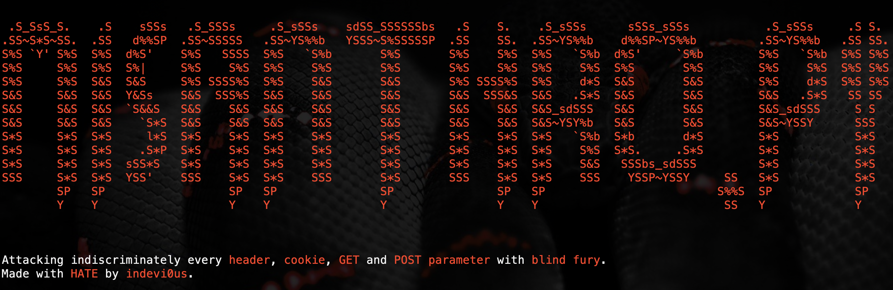

# Misanthro.py
Misanthro.py is a powerful tool designed to test for blind injection vulnerabilities in web applications. It automates the process of identifying and exploiting these vulnerabilities by injecting payloads into HTTP headers, cookies, and GET/POST parameters. Misanthro.py is intended for use by penetration testers and security researchers.

## Features
- Supports injection into HTTP headers, cookies, and GET/POST parameters.
- Can target multiple URLs simultaneously.
- Customizable payloads for different types of injections.
- Verbose output for detailed logging of the attack process (misanthro_log.txt).

## Installation
To use Misanthro.py, you need to have Python3 installed. You can install the required dependencies using pip:

```bash
pip install -r requirements.txt
```

## Arguments
- `--url`: target URL(s). If multiple, divided by comma (e.g., --url https://test.example.com/login,https://test2.example.com/signup).
- `--url-file`: file containing a list of target URLs.
- `--payloads`: file containing payloads for injection.
- `--hate-get`: GET parameters to inject into. If multiple, divided by comma (e.g., --hate-get redirect_url,r,username,redirect_uri).
- `--hate-post`: POST parameters to inject into. If multiple, divided by comma (e.g., --hate-post username,password).
- `--hate-http-header`: HTTP headers to inject into. If multiple, divided by comma (e.g., --hate-http-header User-Agent,X-Forwarded-For,Forwarded,Host).
- `--hate-cookie`: cookies to inject into. If multiple, divided by comma (e.g., --hate-cookie sessionid,userid).
- `--cookie`: custom cookies to include in requests (e.g., testing for authenticated targets).
- `-v`, `-vv`, `--verbose`: verbose output level (-vv is the higher level of verbosity).

## Usage
Below are some examples demonstrating how to use Misanthro.py to test for blind injection vulnerabilities.

### Injecting into GET parameters
```bash
python misanthro.py --url http://example.com/sample --payloads payloads.txt --hate-get param1,param2 -vv
```
This command targets http://example.com and injects payloads from payloads.txt into the GET parameters `param1` and `param2`.

### Injecting into HTTP headers
```bash
python misanthro.py --url http://example.com/sample --payloads payloads.txt --hate-http-header User-Agent,X-Forwarded-For -vv
```
This command targets http://example.com and injects payloads from payloads.txt into the HTTP headers `User-Agent` and `X-Forwarded-For`.

### Injecting into cookies
```bash
python misanthro.py --url http://example.com/sample --payloads payloads.txt --hate-cookie sessionid,userid -vv
```
This command targets http://example.com and injects payloads from payloads.txt into the cookies `sessionid` and `userid`.

### Targeting multiple URLs in-line
```bash
python misanthro.py --url http://example.com/sample,http://example.com/sample2 --payloads payloads.txt --hate-get param1,param2 -vv
```
This command targets http://example.com on both the endpoints /sample and /sample2, injecting payloads from payloads.txt into the GET parameters `param1` and `param2` for all the URLs provided.

### Targeting multiple URLs from a .txt file
```bash
python misanthro.py --url-file urls.txt --payloads payloads.txt --hate-get param1,param2 -vv
```
This command reads URLs from urls.txt and injects payloads from payloads.txt into the GET parameters `param1` and `param2`.
